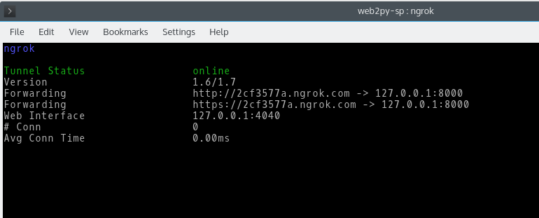
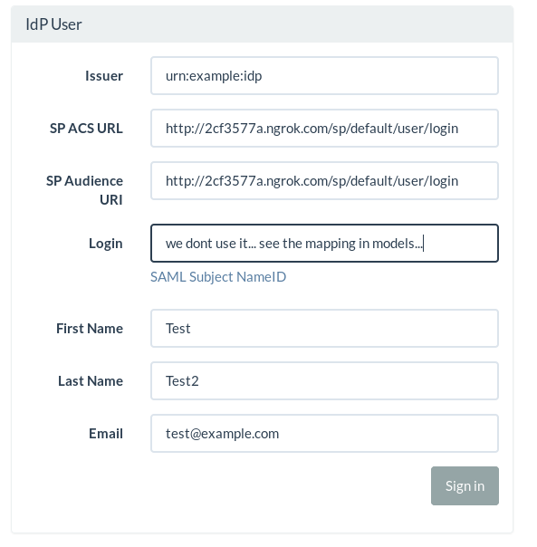
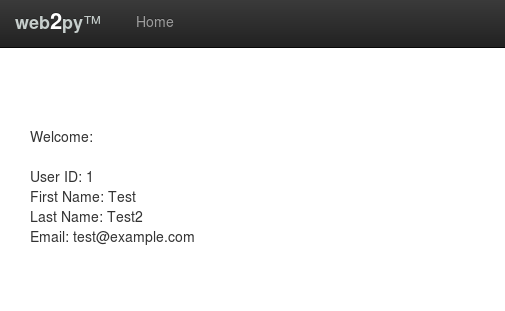

# Introduction

This is an example SAML SP service for web2py using [pysaml2](https://github.com/rohe/pysaml2).

# Installing all the pysaml2 environment (in case you have pysaml2 installed you can skip this step):

## Creating our python virtual env:

```
$ pip install virtualenv
$ cd my_project_folder
$ virtualenv venv
$ source venv/bin/activate
```


## Some pysaml2 requirements:

```
$ pip install mako
```

Last version of xmlsec (probably you will need apt-get install libxml2-dev libxmlsec1-dev):

```
$ git clone git://github.com/mehcode/python-xmlsec.git
$ cd /path/to/xmlsec
$ pip install .
```

NOTE: Be careful if creates a folder in site-packages with the name xmlsec, because when xmldsig try to import xmlsec and xmldsig will try to import folder intead of the module. In my case I have renamed.

```
# sudo apt-get install python-dev libldap2-dev libsasl2-dev libssl-dev
$ pip install python-ldap
$ pip install pymongo
```

To Install binary xmlsec:

```
# sudo apt-get install xmlsec1
# sudo apt-get install libxml2
```

## In my kubunty 15, if I run  **xmlsec1 --help** I got the next error:

```
To fix the next error:
    /usr/bin/xmlsec1 --help
    /usr/bin/xmlsec1: /usr/local/lib/libxml2.so.2: no version information available (required by /usr/bin/xmlsec1)
```

In order to fix it link to the last version of the lib:

```
#sudo ln -s /usr/lib/x86_64-linux-gnu/libxml2.so.2.9.2 /usr/local/lib/libxml2.so.2
```

## To install xmldsig:

```
$ wget ftp://xmlsoft.org/libxml2/libxml2-sources-2.9.2.tar.gz
$ tar xzf libxml2-sources-2.9.2.tar.gz
$ cd libxml2-sources-2.9.2
$ ./configure && make (not need to install)

$ pip install libxml2-sources-2.9.2/python

$ git clone https://github.com/AntagonistHQ/xmldsig.git
$ pip install xmldsig


$ git clone https://github.com/rohe/pysaml2.git
$ pip install pysaml2/
$ cd pysaml2/test
$ pip install pytest
$ py.test
```


# Test web2py SP:


1.  If you do not have a public IP, or your ports open in you router, a easy way to test your local SP web2py with a extern IDP is to create a tunnel. A easy way is to use ngrok:
    
    ```
    #apt-get install ngrok
    $ ngrok 8000
    ```
    
    
In my case I got http://2cf3577a.ngrok.com. I can use this URL to access from Internet intead of localhost.

    
2. Install and start our APP:
        $wget http://www.web2py.com/examples/static/web2py_src.zip
        $unzip web2py_src.zip
        $cd ./web2py/applications
        $git clone https://github.com/josedesoto/web2py-sp-example.git sp #Create the folder sp
        $python ./web2py/web2py.py -p 8000 --password=temporal

3. Before to continue and create the sp.xml file for our SP metadata. We need to modify some configuration in **private/sp_conf.py**. If you take a look, be sure the ngrok URLs are the ones you got in the step 1. 
        
3. Verify you can access to the SP metadata: http://NGROK_ID.ngrok.com/sp/default/metadata this function will create you sp.xml file. In this step we have our SP app example ready. Go to your URL, my case: **http://2cf3577a.ngrok.com/sp/** and lets try to login...

3. Now you have been redirected to the IDP (Identity Provider) the one who will perform the authentication. This is example case, so all the users we introduce here will be validate and bind the POST request to our SP (web2py). Before to continue we need to give to the IDP the information about our SP:
    
        **Issuer:** "urn:example:idp"
        
        **SAML ACS URL:** "<http://NGROK_ID.ngrok.com/sp/default/user/login>"
        
        **SAML Audience URI:** "<http://NGROK_ID.ngrok.com/sp/default/user/login>"
        
        Be sure to replace the string "NGROK_ID" with the sub-domain that ngrok selected for you! Here my example: 

The issuer is the entityID of the IDP, to know this info you can take a look here: **http://idp.oktadev.com/metadata**


## In this step I get the next error:

```
 File "/home/jose/Documents/DESARROLLO/web2py-sp/web2py/gluon/contrib/login_methods/saml2_auth.py", line 113, in login_url
    attributes = d['response'].assertion.attribute_statement[0].attribute
AttributeError: 'dict' object has no attribute 'assertion'
```

In order to fix it find the web2py saml login lib: **./gloun/contrib/login_methods/saml2_auth.py**:

1. Add on the top: from saml2 import BINDING_HTTP_POST
2. line 62: replace: bindings = [BINDING_HTTP_REDIRECT] to bindings = [BINDING_HTTP_REDIRECT, BINDING_HTTP_POST]
3. line 74 (after else) add: binding = BINDING_HTTP_POST 

Remove the saml2_auth.pyc and stop/start web2py again. If everything works well you should get the new user in your web2py environment (if the user does not exist web2py will create it.), see the screenshot:




Thanks to: https://github.com/jpf/okta-pysaml2-example 
